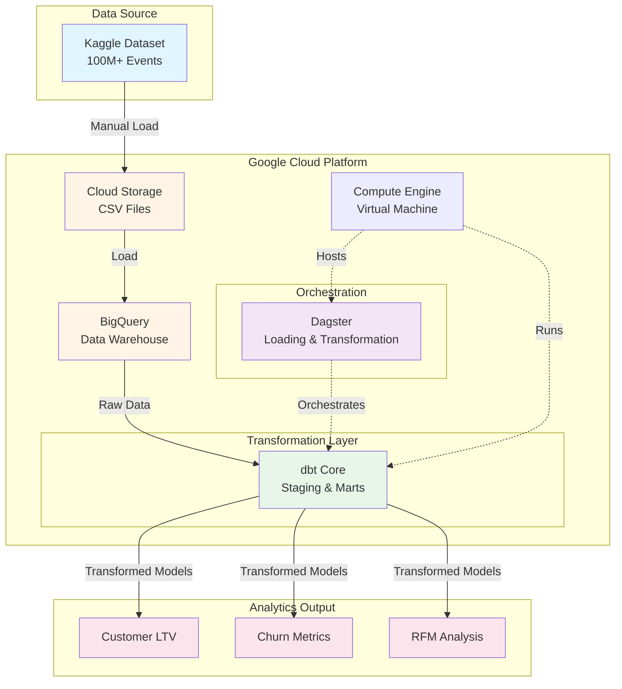

# E-commerce Analytics Pipeline 

## Overview

Marketing analytics for a large [eCommerce events dataset](https://www.kaggle.com/datasets/mkechinov/ecommerce-behavior-data-from-multi-category-store) from [REES46 Marketing Platform](https://rees46.com/).

* A production-style data pipeline that processes 400M+ e-commerce events to generate customer analytics and business insights.
* Built using modern data engineering tools (dbt, Dagster, BigQuery) to demonstrate scalable analytics infrastructure and best practices.
* The pipeline automates data ingestion, transformation, and metric calculation for customer segmentation (RFM analysis), conversion funnel tracking, churn identification, and other KPIs.

## Key Findings

**Customer Segmentation (RFM Analysis)**
- Champions segment (12% of customers) generates average revenue of $3,333, over 3x higher than typical customers
- Identified 135K "At Risk" customers with high historical value ($2,452 avg) who haven't purchased recently
- Lost customers (15%) represent only $110 average revenue (minimal recovery value)
- **Business Impact**: RFM segmentation enables targeted retention campaigns for high-value customers, potentially recovering significant revenue from the "At Risk" segment.

**Churn Analysis (Cohort-Based)**
- **88% of early customers did not make a repeat purchase within 90 days** - indicating significant retention challenges
- October 2019 cohort showed 82% churn rate; November cohort 94%
- Analysis based on customers with sufficient time in dataset to exhibit repeat purchase behavior
- **Business Impact**: High one-time buyer rate suggests critical need for post-purchase engagement, loyalty programs, and retention campaigns

## Pipeline Architecture

## Lineage Graph

## Data Visualizations

### Dashboard - Sales & AOV

### Dashboard - Churn & LTV

### Total Revenue by RFM Segment

### Average Revenue & Population by RFM Segment

