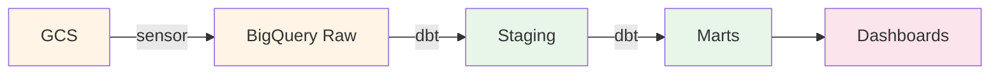
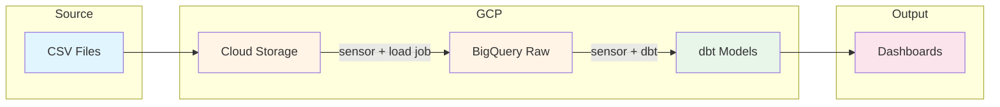

# E-commerce Analytics Pipeline 

[](https://github.com/vbalalian/estore-analytics/actions/workflows/terraform.yml)
[](https://github.com/vbalalian/estore-analytics/actions/workflows/ci-dbt.yml)
[](https://github.com/vbalalian/estore-analytics/actions/workflows/ci-dagster.yml)
[](https://github.com/vbalalian/estore-analytics/actions/workflows/cd.yml)

## Overview

Marketing analytics for a large [eCommerce events dataset](https://www.kaggle.com/datasets/mkechinov/ecommerce-behavior-data-from-multi-category-store) from [REES46 Marketing Platform](https://rees46.com/).


* A production-style data pipeline that processes 400M+ e-commerce events to generate customer analytics and business insights.
* Built using modern data engineering tools (dbt, Dagster, BigQuery) to demonstrate scalable analytics infrastructure and best practices.
* The pipeline automates data ingestion, transformation, and metric calculation for customer segmentation (RFM analysis), conversion funnel tracking, churn identification, and other KPIs.



## Contents
- [Key Findings](#key-findings)
- [Tech Stack](#tech-stack)
- [Getting Started](#getting-started)
- [Pipeline Architecture](#pipeline-architecture)
- [Data Models](#data-models)
- [Documentation](#documentation)

## Key Findings

- **RFM Segmentation**: Champions (12% of customers) generate 3x higher revenue ($3,333 avg); 135K high-value "At Risk" customers identified for retention campaigns
- **Churn**: 88% of early customers did not make a repeat purchase within 90 days
- **Conversion Funnel**: 6.1% view-to-purchase rate; 88% drop-off before cart, 49% cart abandonment

## Tech Stack
- **Data Warehouse**: BigQuery - serverless, scales to petabytes, native partitioning/clustering
- **Transformation**: dbt Core - version-controlled SQL, built-in testing, lineage tracking
- **Orchestration**: Dagster - asset-based paradigm, first-class dbt integration, superior observability
- **Infrastructure**: Google Cloud Platform - seamless BigQuery integration, cost-effective compute
- **Infrastructure as Code**: Terraform - declarative, reproducible infrastructure with state management
- **CI/CD**: GitHub Actions - native repo integration, matrix builds for parallel testing
- **Visualization**: Tableau - handles large datasets, flexible for both operational and strategic dashboards

## Getting Started

### Prerequisites

- **Python** 3.9 - 3.13
- **Terraform** >= 1.0
- **gcloud CLI** authenticated with your GCP project
- **GCP Project** with BigQuery and Cloud Storage APIs enabled
- **Service Account** with roles: BigQuery Admin, Storage Admin

### Infrastructure Setup

Provision the required GCP resources using Terraform:

```bash
cd terraform
cp terraform.tfvars.example terraform.tfvars
# Edit terraform.tfvars with your GCP project ID and bucket name
terraform init
terraform apply
```

See [terraform/README.md](terraform/README.md) for detailed setup instructions.

### dbt Configuration

Configure dbt to connect to your BigQuery instance:

```bash
cd dbt-project
cp profiles.yml.example profiles.yml
# Edit profiles.yml with your GCP project ID and service account key path
```

### Running the Pipeline

1. Upload raw data CSV files to the GCS bucket
2. Dagster sensors automatically detect new files and trigger data loads
3. Transformations run automatically after successful loads

## Pipeline Architecture



## Data Models

**Staging Layer**
- `stg_events` - Cleaned event data

**Dimension Tables**
- `dim_users` - User-level metrics (LTV, churn status, purchase history)
- `dim_products` - Product attributes and category hierarchy
- `dim_categories` - Category taxonomy
- `dim_user_rfm` - RFM scores and customer segments

**Fact Tables**
- `fct_events` - Event-level facts with purchase/cart/view flags
- `fct_sessions` - Session-level aggregations with conversion funnel

**Metrics**
- `metrics_conversion_rates` - Daily/overall conversion metrics
- `metrics_churn` - Churn rates by cohort
- `metrics_rfm_segments` - Aggregated segment-level metrics

**Snapshots (SCD Type 2)**
- `snap_user_rfm` - Tracks changes to RFM segments over time
- `snap_user_status` - Tracks changes to user activity/churn status

## Technical Highlights

- **Incremental Processing**: Fact tables use dbt's `insert_overwrite` strategy with daily date partitioning, processing only new/changed partitions rather than full table scans
- **Event-Driven Orchestration**: GCS sensor polls for new files every 5 minutes with cursor-based tracking to prevent duplicate processing; successful loads automatically trigger dbt runs via a chained `run_status_sensor`
- **RFM Segmentation**: Percentile-based scoring using BigQuery's `NTILE()` window functions, with configurable thresholds for 9 actionable customer segments
- **Data Quality**: dbt tests validate referential integrity, accepted values, and null constraints; CI pipeline runs tests against isolated BigQuery datasets per PR

## Lineage Graph


## Documentation

- [Analysis & Visualizations](analysis/README.md) - Dashboard screenshots and detailed insights
- [Orchestration](docs/orchestration.md) - Dagster sensors, jobs, and scheduling patterns
