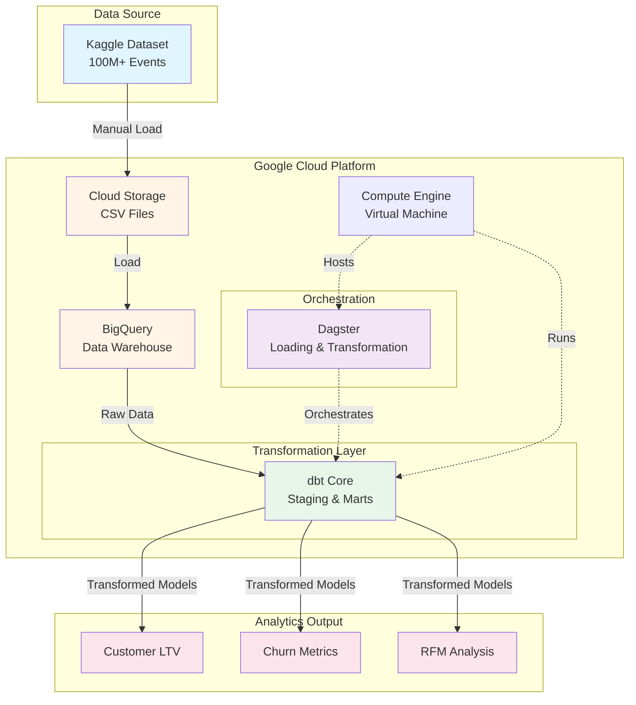

# E-commerce Analytics Pipeline 

## Overview

Marketing analytics for a large [eCommerce events dataset](https://www.kaggle.com/datasets/mkechinov/ecommerce-behavior-data-from-multi-category-store) from [REES46 Marketing Platform](https://rees46.com/).

* A production-style data pipeline that processes millions of e-commerce events to generate customer analytics and business insights.
* Built using modern data engineering tools (dbt, Dagster, BigQuery) to demonstrate scalable analytics infrastructure and best practices.
* The pipeline automates data ingestion, transformation, and metric calculation for customer segmentation (RFM analysis), conversion funnel tracking, and churn identification.

## Pipeline Architecture

## Lineage Graph

## Data Visualizations

## Roadmap
- [X] Automate GCS → BigQuery loading
- [X] Complete dbt models for key metrics
- [ ] Build analytics dashboards
