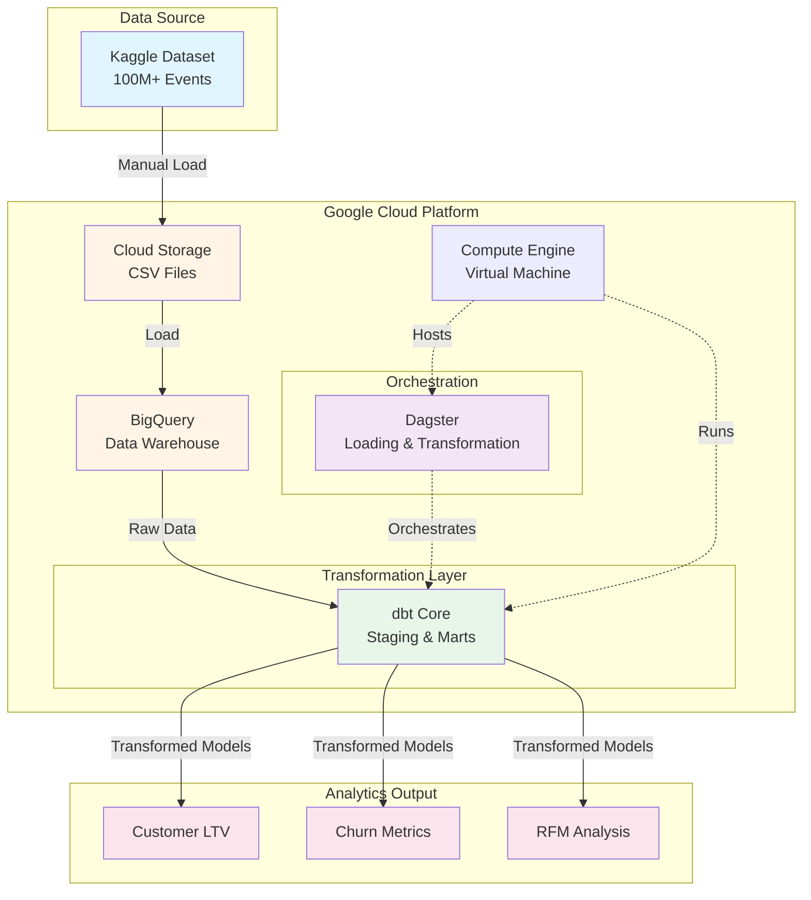

# E-commerce Analytics Pipeline 

[](https://github.com/vbalalian/estore-analytics/actions/workflows/terraform.yml)
[](https://github.com/vbalalian/estore-analytics/actions/workflows/ci-dbt.yml)
[](https://github.com/vbalalian/estore-analytics/actions/workflows/ci-dagster.yml)
[](https://github.com/vbalalian/estore-analytics/actions/workflows/cd.yml)

## Overview

Marketing analytics for a large [eCommerce events dataset](https://www.kaggle.com/datasets/mkechinov/ecommerce-behavior-data-from-multi-category-store) from [REES46 Marketing Platform](https://rees46.com/).


* A production-style data pipeline that processes 400M+ e-commerce events to generate customer analytics and business insights.
* Built using modern data engineering tools (dbt, Dagster, BigQuery) to demonstrate scalable analytics infrastructure and best practices.
* The pipeline automates data ingestion, transformation, and metric calculation for customer segmentation (RFM analysis), conversion funnel tracking, churn identification, and other KPIs.

## Contents
- [Key Findings](#key-findings)
- [Tech Stack](#tech-stack)
- [Getting Started](#getting-started)
- [Pipeline Architecture](#pipeline-architecture)
- [Data Models](#data-models)
- [Data Visualizations](#data-visualizations)

## Key Findings

**Customer Segmentation (RFM Analysis)**
- Champions segment (12% of customers) generates average revenue of $3,333, over 3x higher than typical customers
- Identified 135K "At Risk" customers with high historical value ($2,452 avg) who haven't purchased recently
- Lost customers (15%) represent only $110 average revenue (minimal recovery value)
- **Business Impact**: RFM segmentation enables targeted retention campaigns for high-value customers, potentially recovering significant revenue from the "At Risk" segment.

**Churn Analysis (Cohort-Based)**
- **88% of early customers did not make a repeat purchase within 90 days** - indicating significant retention challenges
- October 2019 cohort showed 82% churn rate; November cohort 94%
- Analysis based on customers with sufficient time in dataset to exhibit repeat purchase behavior
- **Business Impact**: High one-time buyer rate suggests critical need for post-purchase engagement, loyalty programs, and retention campaigns

**Conversion Funnel Analysis**
- 88% of sessions with product views do not add items to cart - indicating significant friction at the browsing/consideration stage
- Cart abandonment rate of 49% - approximately half of users who add items to cart fail to complete purchase
- Overall view-to-purchase conversion rate of 6.1%, with only 1 in 16 browsing sessions resulting in a sale
- **Business Impact**: The primary conversion bottleneck occurs before cart addition. Focus should be on product presentation, pricing transparency, and trust signals to improve view-to-cart conversion. Secondary priority is cart abandonment recovery campaigns.

## Tech Stack
- **Data Warehouse**: BigQuery — serverless, scales to petabytes, native partitioning/clustering
- **Transformation**: dbt Core — version-controlled SQL, built-in testing, lineage tracking
- **Orchestration**: Dagster — asset-based paradigm, first-class dbt integration, superior observability
- **Infrastructure**: Google Cloud Platform — seamless BigQuery integration, cost-effective compute
- **Infrastructure as Code**: Terraform — declarative, reproducible infrastructure with state management
- **CI/CD**: GitHub Actions — native repo integration, matrix builds for parallel testing
- **Visualization**: Tableau — handles large datasets, flexible for both operational and strategic dashboards

## Getting Started

### Prerequisites

- **Python** 3.9 - 3.13
- **Terraform** >= 1.0
- **gcloud CLI** authenticated with your GCP project
- **GCP Project** with BigQuery and Cloud Storage APIs enabled
- **Service Account** with roles: BigQuery Admin, Storage Admin

### Infrastructure Setup

Provision the required GCP resources using Terraform:

```bash
cd terraform
cp terraform.tfvars.example terraform.tfvars
# Edit terraform.tfvars with your GCP project ID and bucket name
terraform init
terraform apply
```

See [terraform/README.md](terraform/README.md) for detailed setup instructions.

### dbt Configuration

Configure dbt to connect to your BigQuery instance:

```bash
cd dbt-project
cp profiles.yml.example profiles.yml
# Edit profiles.yml with your GCP project ID and service account key path
```

### Running the Pipeline

1. Upload raw data CSV files to the GCS bucket
2. Dagster sensors automatically detect new files and trigger data loads
3. Transformations run automatically after successful loads

## Pipeline Architecture



## Data Models

**Staging Layer**
- `stg_events` - Cleaned event data

**Dimension Tables**
- `dim_users` - User-level metrics (LTV, churn status, purchase history)
- `dim_products` - Product attributes and category hierarchy
- `dim_categories` - Category taxonomy
- `dim_user_rfm` - RFM scores and customer segments

**Fact Tables**
- `fct_events` - Event-level facts with purchase/cart/view flags
- `fct_sessions` - Session-level aggregations with conversion funnel

**Metrics**
- `metrics_conversion_rates` - Daily/overall conversion metrics
- `metrics_churn` - Churn rates by cohort
- `metrics_rfm_segments` - Aggregated segment-level metrics

**Snapshots (SCD Type 2)**
- `snap_user_rfm` - Tracks changes to RFM segments over time
- `snap_user_status` - Tracks changes to user activity/churn status

## Technical Highlights

- **Incremental Processing**: Fact tables use dbt's `insert_overwrite` strategy with daily date partitioning, processing only new/changed partitions rather than full table scans
- **Event-Driven Orchestration**: GCS sensor polls for new files every 5 minutes with cursor-based tracking to prevent duplicate processing; successful loads automatically trigger dbt runs via a chained `run_status_sensor`
- **RFM Segmentation**: Percentile-based scoring using BigQuery's `NTILE()` window functions, with configurable thresholds for 9 actionable customer segments
- **Data Quality**: dbt tests validate referential integrity, accepted values, and null constraints; CI pipeline runs tests against isolated BigQuery datasets per PR

## Lineage Graph


## Data Visualizations

### Dashboard - Sales & AOV


**Key Insights:** This operational dashboard tracks daily performance against historical benchmarks. The $9.61M daily sales figure (+2.70% week-over-week) provides immediate context, while the AOV gauge shows current performance ($286) against a $350 target - useful for spotting whether revenue growth is coming from volume or basket size.

The month-over-month trend reveals seasonality: the yellow line (likely a holiday period) peaks near $15M before settling to a more stable $7-10M range. The mid-February AOV spike to $715 warrants investigation - possibly a promotional event or bulk order anomaly.

The conversion funnel tells a clear story: 88.5M browsing sessions drop to 10.6M carts (88% falloff) and 5.4M purchases (51% cart completion). That ~12% browse-to-cart rate is typical for e-commerce, but the 51% cart-to-purchase rate suggests room to improve checkout friction or cart abandonment campaigns.

### Dashboard - Churn & LTV


**Key Insights:** The LTV distribution shows classic e-commerce behavior: heavily right-skewed with 725K+ customers concentrated in the $0-$100 range, but combined revenue (blue bars) reveals that mid-tier customers ($200-$600) drive significant total value despite smaller populations.

The weekly churn cohort analysis is particularly actionable. Early cohorts (Oct-Nov 2019) show 82-84% churn rates, meaning only 16-18% of first-time buyers made a repeat purchase. More recent cohorts (Apr 2020) show lower churn rates of 69-75%, though this likely reflects insufficient observation time rather than improved retention.

The Top 15 by LTV table ($386K-$790K) identifies high-value accounts worth dedicated attention - these customers represent outsized revenue concentration.

### Total Revenue by RFM Segment


**Key Insights:** The classic Pareto principle in action: **12.2% of customers (Champions) generate 40.7% of total revenue** ($830M). This visualization makes segment prioritization immediately clear through proportional area.

The strategic concern jumps out: **134.76K high-value "At Risk" customers represent 16.2% of revenue**. These are customers with strong historical value but declining engagement - prime candidates for win-back campaigns before they slip into "Lost."

Potential Loyalists (yellow, $420M total) represent the clearest growth opportunity: customers with good spend patterns who could become Champions with the right engagement. The embedded recommendations (e.g., "Encourage second/third purchase" for Potential Loyalists) translate segmentation directly into action.

### Average Revenue & Population by RFM Segment


**Key Insights:** This view reveals the value-versus-volume tradeoff across segments. Champions occupy the ideal upper-right quadrant (high revenue, substantial population), while the "At Risk" bubble - positioned at high average revenue but smaller population - shows the concentration of valuable customers who need retention focus.

The visual separation between high-value segments (Champions, At Risk, Potential Loyalists) and lower-value segments (Recent, Lost, Promising) clustered at the bottom makes resource allocation decisions intuitive: invest in the top cluster, automate engagement for the bottom.

Recent Customers (342K, largest population) sitting at low average revenue isn't alarming - it's expected for new customers who haven't had time to mature.


**Key Insights:** This paired bar chart tells the same story as the bubble chart but makes the magnitude differences more precise. The Champions segment's $3,333 average dwarfs Recent Customers' $254 - a 13x difference that underscores why segment-specific strategies matter.

The juxtaposition of "Lost" (307K customers, $110 avg) against "Champions" (249K customers, $3,333 avg) quantifies the cost of churn: losing a Champion requires winning ~30 new customers to replace the revenue.
