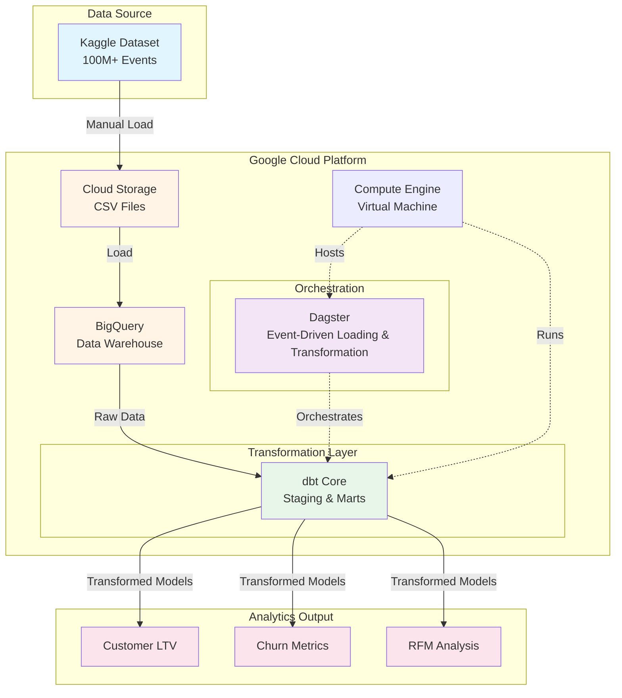

# E-Store Marketing Analytics 

## Overview

Marketing analytics for a large [eCommerce events dataset](https://www.kaggle.com/datasets/mkechinov/ecommerce-behavior-data-from-multi-category-store) from [REES46 Marketing Platform](https://rees46.com/).

## Pipeline Architecture

## Insights

## Roadmap
- [X] Automate GCS → BigQuery loading
- [X] Complete dbt models for key metrics
- [ ] Build analytics dashboards
