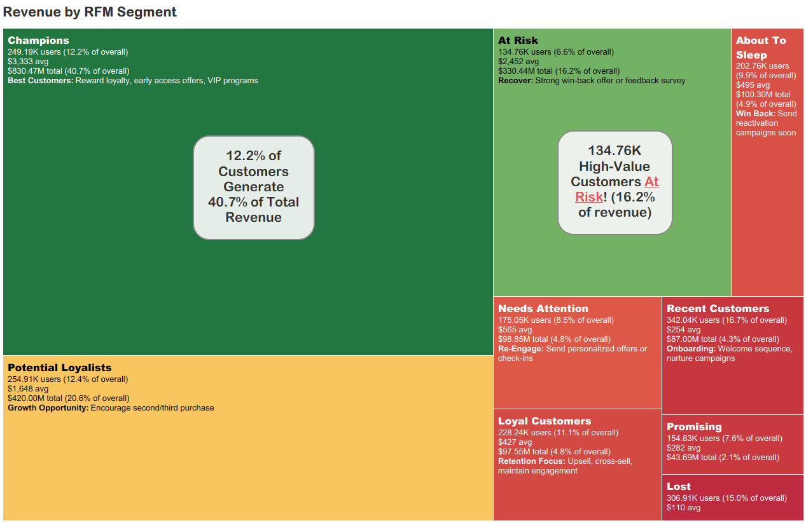

# Analysis & Visualizations

This document contains detailed analysis of the e-commerce dataset, including dashboard screenshots and insights derived from the data models.

## Data Visualizations

### Dashboard - Sales & AOV

**Key Insights:** This operational dashboard tracks daily performance against historical benchmarks. The $9.61M daily sales figure (+2.70% week-over-week) provides immediate context, while the AOV gauge shows current performance ($286) against a $350 target - useful for spotting whether revenue growth is coming from volume or basket size.

The month-over-month trend reveals seasonality: the yellow line (likely a holiday period) peaks near $15M before settling to a more stable $7-10M range. The mid-February AOV spike to $715 warrants investigation - possibly a promotional event or bulk order anomaly.

The conversion funnel tells a clear story: 88.5M browsing sessions drop to 10.6M carts (88% falloff) and 5.4M purchases (51% cart completion). That ~12% browse-to-cart rate is typical for e-commerce, but the 51% cart-to-purchase rate suggests room to improve checkout friction or cart abandonment campaigns.

### Dashboard - Churn & LTV

**Key Insights:** The LTV distribution shows classic e-commerce behavior: heavily right-skewed with 725K+ customers concentrated in the $0-$100 range, but combined revenue (blue bars) reveals that mid-tier customers ($200-$600) drive significant total value despite smaller populations.

The weekly churn cohort analysis is particularly actionable. Early cohorts (Oct-Nov 2019) show 82-84% churn rates, meaning only 16-18% of first-time buyers made a repeat purchase. More recent cohorts (Apr 2020) show lower churn rates of 69-75%, though this likely reflects insufficient observation time rather than improved retention.

The Top 15 by LTV table ($386K-$790K) identifies high-value accounts worth dedicated attention - these customers represent outsized revenue concentration.

### Total Revenue by RFM Segment

**Key Insights:** The classic Pareto principle in action: **12.2% of customers (Champions) generate 40.7% of total revenue** ($830M). This visualization makes segment prioritization immediately clear through proportional area.

The strategic concern jumps out: **134.76K high-value "At Risk" customers represent 16.2% of revenue**. These are customers with strong historical value but declining engagement - prime candidates for win-back campaigns before they slip into "Lost."

Potential Loyalists (yellow, $420M total) represent the clearest growth opportunity: customers with good spend patterns who could become Champions with the right engagement. The embedded recommendations (e.g., "Encourage second/third purchase" for Potential Loyalists) translate segmentation directly into action.

### Average Revenue & Population by RFM Segment

**Key Insights:** This view reveals the value-versus-volume tradeoff across segments. Champions occupy the ideal upper-right quadrant (high revenue, substantial population), while the "At Risk" bubble - positioned at high average revenue but smaller population - shows the concentration of valuable customers who need retention focus.

The visual separation between high-value segments (Champions, At Risk, Potential Loyalists) and lower-value segments (Recent, Lost, Promising) clustered at the bottom makes resource allocation decisions intuitive: invest in the top cluster, automate engagement for the bottom.

Recent Customers (342K, largest population) sitting at low average revenue isn't alarming - it's expected for new customers who haven't had time to mature.

**Key Insights:** This paired bar chart tells the same story as the bubble chart but makes the magnitude differences more precise. The Champions segment's $3,333 average dwarfs Recent Customers' $254 - a 13x difference that underscores why segment-specific strategies matter.

The juxtaposition of "Lost" (307K customers, $110 avg) against "Champions" (249K customers, $3,333 avg) quantifies the cost of churn: losing a Champion requires winning ~30 new customers to replace the revenue.
