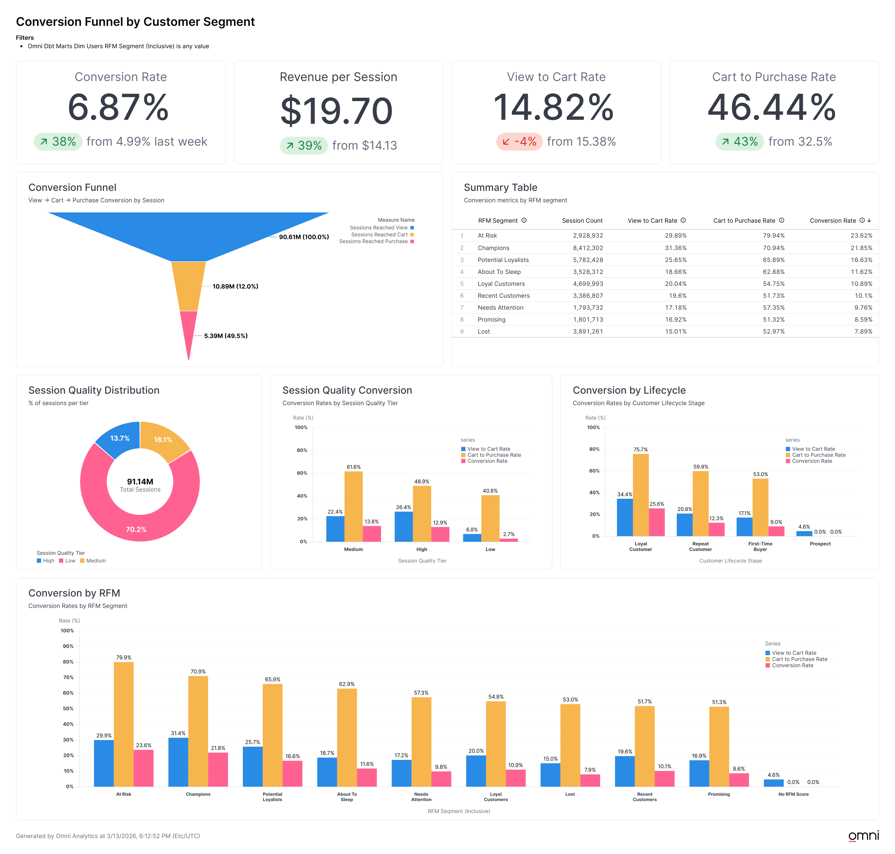
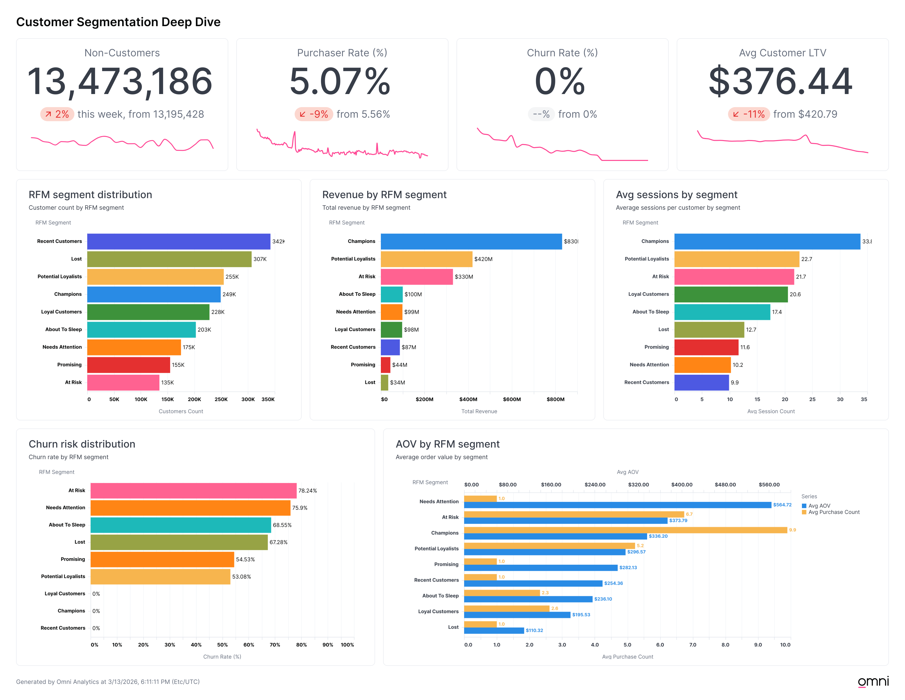
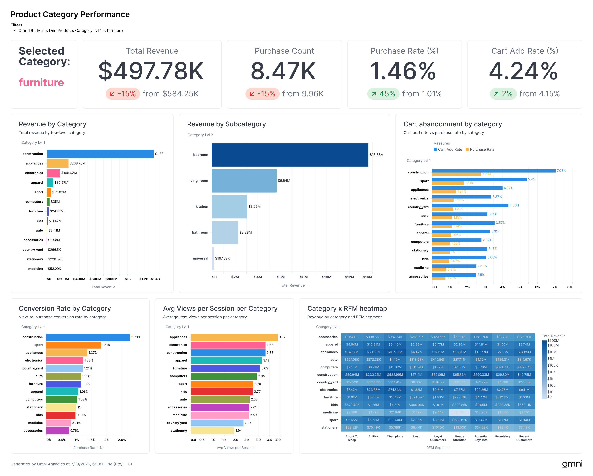

# Analysis & Visualizations

All visualizations built on [Omni Analytics](https://omni.co/), connected to the dbt semantic layer via bi-directional integration. Custom measures, dimensions, and RFM segmentation logic are defined in the Omni model YAML (see [`omni/`](/omni/BigQuery/)) and sync with dbt metadata on schema refresh.

## Conversion Funnel by Customer Segment

The top-level numbers tell the story: 5.92% overall conversion rate across 91M sessions, with an 88% drop-off before cart and ~50% cart abandonment. Revenue per session sits at $22.41.

The funnel itself (90.6M views → 10.9M carts → 5.4M purchases) is expected for e-commerce at this scale. The more interesting layer is how that funnel behaves across customer segments.

The RFM segment conversion chart (bottom) shows At Risk customers converting at 23.6% and Champions at 21.9%, both well above the site average. These are established buyers who know what they want. The "No RFM Score" group (non-purchasers, 13.47M users) barely registers, which creates the visual illusion of a low overall rate when in reality the site converts returning customers at a healthy clip.

Session quality has a non-obvious finding: medium-quality sessions (16.1% of total) actually convert at 13.8%, slightly above high-quality sessions at 12.9%. High-quality sessions have better view-to-cart (26.4% vs 22.4%) but worse cart-to-purchase (48.9% vs 61.6%), suggesting that heavier browsing correlates with more abandoned carts. Medium-tier users are more decisive once they add to cart. Low-quality sessions (70.2% of total) convert at just 2.7%, though the few users who do reach cart complete purchase 40.8% of the time.

The lifecycle stage breakdown confirms the pattern: loyal customers have a 34.4% view-to-cart rate and 75.7% cart-to-purchase rate, landing at 25.6% overall conversion. First-time buyers sit at 9.0%. The biggest conversion gap isn't at the top of the funnel; it's in getting first-time buyers to come back.

## Customer Segmentation Deep Dive

13.47M non-customers against a 13.2% purchaser rate means roughly 2M users have made at least one purchase. Average customer LTV is $996.83, with a 5.18% churn rate.

The segment distribution chart shows Recent Customers as the largest segment (342K), which is expected. Revenue tells a different story: Champions (249K customers) generate $830M, more than double the next segment (Potential Loyalists at $420M). That's the Pareto principle at work: 12% of customers driving ~40% of revenue.

The churn risk chart is where the actionable insight lives. At Risk customers have a 78.24% churn rate and average 21.7 sessions per customer, meaning these are users who *were* highly engaged. The $330M in At Risk revenue represents the clearest retention opportunity in the dataset. Champions, Loyal Customers, and Recent Customers all show 0% churn, which makes sense given how the RFM scoring defines recency.

The AOV chart surfaces a non-obvious finding: Needs Attention customers have the highest average order value at $564.71, above Champions ($336.21). These are high-value-per-transaction customers whose engagement is dropping. Combined with their 75.9% churn rate, this segment is arguably more urgent than At Risk for targeted outreach since they spend more per order when they do buy.

## Product Category Performance

This workbook uses an interactive category filter (shown filtered to appliances: $268.78M revenue, 973.73K purchases, 1.37% purchase rate).

The unfiltered revenue view shows construction dominating at $1.33B, roughly 5x the next category (appliances at $268.78M). But revenue alone is misleading. The conversion rate chart flips the rankings: construction also leads at 2.78%, but sport (1.81%) and appliances (1.37%) outperform electronics (1.23%) despite lower revenue, suggesting different browsing-to-buying patterns by category.

The cart abandonment chart compares cart add rate to purchase rate by category. Construction has the largest absolute gap (7.05% cart add vs 2.78% purchase), meaning roughly 60% of construction shoppers who add to cart don't complete purchase. For a high-revenue category, that gap represents significant recoverable revenue through abandoned cart campaigns.

Average views per session ranges from 3.81 (appliances) down to 1.94 (stationery), indicating that some categories involve more comparison shopping than others. Categories with high views-per-session but low conversion (e.g., electronics at 3.33 views, 1.23% conversion) may benefit from better product comparison tools or clearer differentiation.

The Category x RFM heatmap in the bottom-right ties category revenue back to customer segments, showing where Champions and At Risk customers concentrate their spending. This enables category-specific retention targeting rather than one-size-fits-all campaigns.
