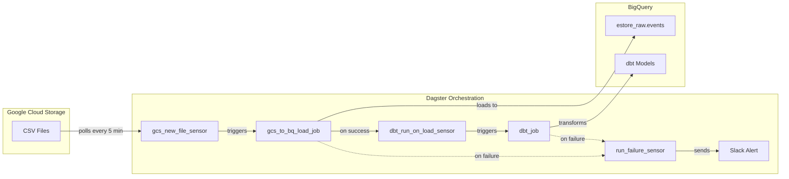

# Orchestration

This document describes the Dagster orchestration layer that manages data ingestion and transformation for the estore-analytics pipeline.

## Overview

The pipeline uses an event-driven architecture with sensor-based triggers. When new data files land in GCS, sensors detect them and automatically trigger downstream jobs, ensuring data freshness without manual intervention.



## Sensors

### gcs_new_file_sensor

**Purpose**: Monitors a GCS bucket for new CSV files and triggers data loading.

**Location**: `dagster-project/src/dagster_project/defs/sensors/gcs_new_file_sensor.py`

**Configuration**:
- Polls every 5 minutes (`minimum_interval_seconds=300`)
- Bucket and destination table configured via constants in sensor file

**Behavior**:
1. Checks cursor to determine last processed file
2. Uses `get_gcs_keys()` to find new files since cursor
3. Yields a `RunRequest` for each new file
4. Cursor advances only after successful job completion

### dbt_run_on_load_sensor

**Purpose**: Triggers dbt transformations after successful data loads.

**Location**: `dagster-project/src/dagster_project/defs/sensors/dbt_run_on_load_sensor.py`

**Configuration**:
- Monitors: `gcs_to_bq_load_job`
- Triggers: `dbt_job`
- Minimum interval: 5 minutes

**Behavior**:
1. Watches for successful `gcs_to_bq_load_job` runs
2. Uses time-windowed `run_key` (15-minute buckets) to deduplicate
3. Triggers `dbt_job` to transform newly loaded data

### run_failure_sensor

**Purpose**: Sends Slack alerts when jobs fail.

**Location**: `dagster-project/src/dagster_project/defs/sensors/run_failure_sensor.py`

**Configuration**:
- Monitors: `dbt_job`, `gcs_to_bq_load_job`
- Minimum interval: 60 seconds
- Alert channel configured in sensor file

**Behavior**:
1. Detects failed runs for monitored jobs
2. Extracts job name, run ID, and error message
3. Posts formatted alert to Slack

## Jobs

### gcs_to_bq_load_job

**Purpose**: Loads CSV files from GCS into BigQuery raw table.

**Location**: `dagster-project/src/dagster_project/defs/jobs/__init__.py`

**Configuration**:
- Uses `import_gcs_paths_to_bq` op from `dagster-gcp`
- Source format: CSV with auto-detection
- Write disposition: `WRITE_APPEND`

### dbt_job

**Purpose**: Runs all dbt models to transform raw data into analytics-ready tables.

**Configuration**:
- Selects all assets in the `dbt_models` group
- Managed as Dagster assets for lineage tracking

### dbt_snapshot_job

**Purpose**: Runs dbt snapshots to capture SCD Type 2 changes.

**Configuration**:
- Runs `snap_user_rfm` and `snap_user_status` snapshots
- Triggered weekly via schedule (Sundays at 1 AM)

## Schedules

### daily_pipeline_schedule

- **Job**: `dbt_job`
- **Cron**: `0 0 * * *` (daily at midnight)
- **Purpose**: Ensures dbt models run daily even without new file loads

### weekly_snapshot_schedule

- **Job**: `dbt_snapshot_job`
- **Cron**: `0 1 * * 0` (Sundays at 1 AM)
- **Purpose**: Captures weekly snapshots for historical tracking

## Cursor-Based Idempotency

The `gcs_new_file_sensor` implements cursor-based tracking to ensure exactly-once processing:

1. **Cursor Storage**: Dagster persists the cursor (last processed GCS key) across sensor ticks
2. **Success Verification**: Before advancing cursor, sensor checks that the last triggered run succeeded
3. **Retry on Failure**: If a run fails, cursor stays unchanged so the file is reprocessed
4. **Tag-Based Tracking**: Each `RunRequest` tags `latest_gcs_key` for cursor update after success

```python
# Cursor advancement logic
if last_run.is_success:
    new_cursor = last_run.tags.get("latest_gcs_key")
    context.update_cursor(new_cursor)
else:
    # Keep cursor unchanged to retry failed file
    pass
```

This pattern prevents duplicate processing while ensuring failed loads are retried.

## Error Handling

### Sensor-Level Error Handling

All sensors wrap their logic in try/except blocks:

```python
try:
    # Sensor logic
except Exception as e:
    context.log.error(f"Sensor failed: {e}")
    return SkipReason(f"Sensor error: {e}")
```

This ensures sensor crashes don't go unnoticed and the sensor retries on the next tick.

### Job-Level Error Handling

- `run_failure_sensor` monitors all critical jobs
- Failed runs trigger immediate Slack alerts with job name and run ID
- Cursor-based tracking ensures failed loads are retried

### Limitations

- Sensor health monitoring is manual (check Dagster UI)
- No alerting if a sensor stops ticking entirely
- See [Future Improvements](#future-improvements) for production-grade monitoring options

## Production Deployment

Dagster runs on a GCP Compute Engine VM as two systemd services:

| Service | Description | Port |
|---------|-------------|------|
| `dagster` | Daemon process for sensors and schedules | - |
| `dagster-webserver` | Web UI (binds to localhost) | 3000 |

### Accessing the UI

The webserver binds to `127.0.0.1` for security. Access via SSH tunnel:

```bash
gcloud compute ssh INSTANCE_NAME --zone=ZONE -- -L 3000:localhost:3000
# Open http://localhost:3000 in your browser
```

### Service Management

```bash
# Check service status
sudo systemctl status dagster dagster-webserver

# View logs
journalctl -u dagster -f
journalctl -u dagster-webserver -f

# Restart services
sudo systemctl restart dagster dagster-webserver
```

### Configuration Files

| File | Purpose |
|------|---------|
| `/etc/systemd/system/dagster.service` | Daemon service definition |
| `/etc/systemd/system/dagster-webserver.service` | Webserver service definition |
| `/etc/systemd/system/dagster.service.d/override.conf` | Secrets (Slack token) |
| `~/estore-analytics/dagster-project/dagster.yaml` | Dagster instance config |
| `~/estore-analytics/dagster-project/.env` | Environment variables |

### Infrastructure as Code

The VM and services are provisioned via Terraform. See `terraform/startup.sh` for the full provisioning script that:
- Creates the deploy user
- Installs dependencies and clones the repo
- Sets up the Python virtualenv
- Installs and enables systemd services

## Future Improvements

The following issues document potential enhancements that would be appropriate at production scale:

- [Incremental model schema change detection](https://github.com/vbalalian/estore-analytics/issues/139) - Auto-detect when full refresh is needed
- [Migrate to BigQuery external tables](https://github.com/vbalalian/estore-analytics/issues/140) - Eliminate load job step
- [Sensor health monitoring](https://github.com/vbalalian/estore-analytics/issues/141) - Proactive alerting for stuck sensors

These are intentionally not implemented - the current architecture is sufficient for the project's scale while demonstrating awareness of production patterns.
